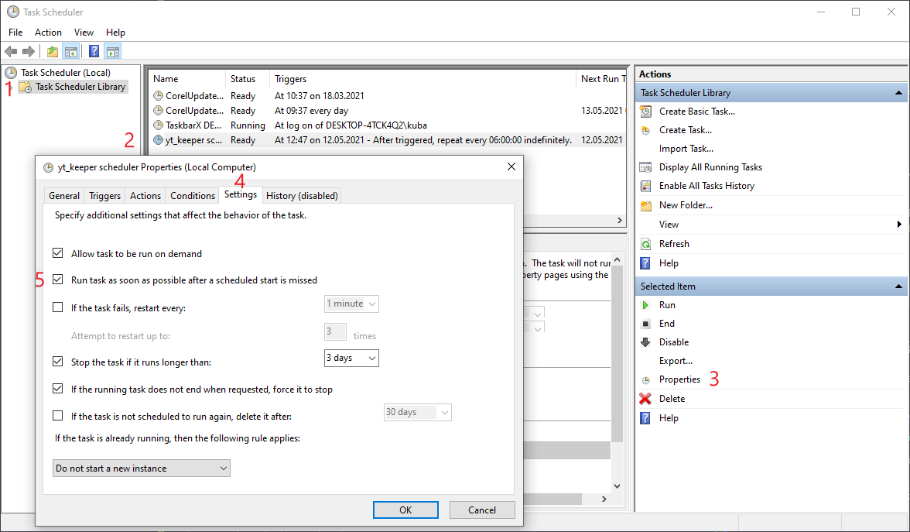

# <center>yt_keeper</center>
<center>Keep any YouTube playlist intact.</center>

Have you ever had a playlist where you had some videos deleted? This
tool aims to prevent that by downloading videos that are still 
available on YouTube. This of course won't recover any deleted or 
private videos, but if you download them before they get removed - you
are free to keep it, forever.

> Note: every playlist downloadable with `youtube_dl` is supported.

# Installing
*Below steps assume you have Python 3 installed on your machine.* 
<details open>
<summary>With pipx (recommended)</summary>

By using pipx you avoid possible conflicts with other Python programs.
Installing with pipx is straightforward:
```
pipx install git+https://github.com/jakubkazimierczak/yt_keeper
```
> Installing pipx is literally two commands:
> ```bash
> # On Linux 
> python3 -m pip install --user pipx
> python3 -m pipx ensurepath
> # On Windows
> python -m pip install --user pipx
> python -m pipx ensurepath
> ```
> Restart your terminal/cmd, and you're ready to use pipx.

</details>

<details>
<summary>With pip</summary>

If you want to install it with pure pip:
```bash
pip install git+https://github.com/jakubkazimierczak/yt_keeper
```
This might potentially cause conflicts with dependencies of other
installed Python software on your machine - that's why using pipx
is advisable.
</details>

# Configuring
You can find configuration in `.config` in your home dir, precisely:
* on Windows: `%userprofile%/.config/yt_keeper/config.yml`
* on Linux: `~/.config/yt_keeper/config.yml`

You have to edit this file before the first run.

# Scheduling runs
Any videos can be deleted at any time. If you want to keep them, you
have to download them before they get deleted. That's why it's worth 
creating a scheduled task to run yt_keeper.

Below you can find instructions on how to create a scheduled task, that
will run yt_keeper every 6 hours.
> Below instructions assume you installed this program with pipx.

<details>
<summary>Windows: using Task Scheduler</summary>

Press `WINDOWS` and `r` key at the same time. In opened window paste
this command:
```
schtasks.exe /create /SC HOURLY /MO 6 /TN "yt_keeper scheduler" /TR "%userprofile%\.local\pipx\venvs\yt-keeper\Scripts\yt_keeper.exe"
```
and click OK button. The task will be run 6 hours from now (and so on).
> Note: If you want to run the task after missed scheduled start
> (e.g. when you had your device powered off) you need to edit it 
> manually. To do so, open Task Scheduler, find yt_keeper task
> and edit its properties:
> 
> 
</details>

<details>
<summary>Linux: using crontab</summary>

Open a terminal, and open crontab with `crontab -e`. In the crontab
add this line:
```
0 */6 * * * ~/.local/bin/yt_keeper
```
Save the file and exit. Changes will be applied automatically.
</details>
